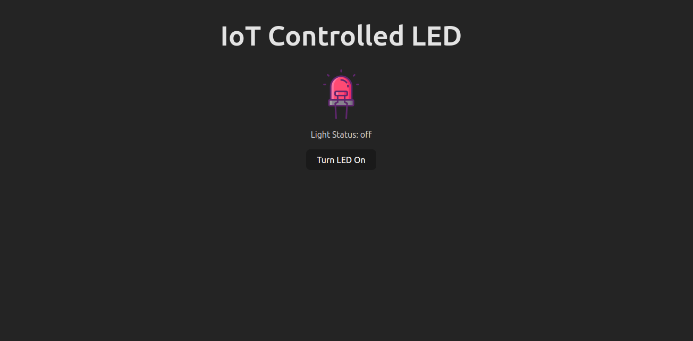
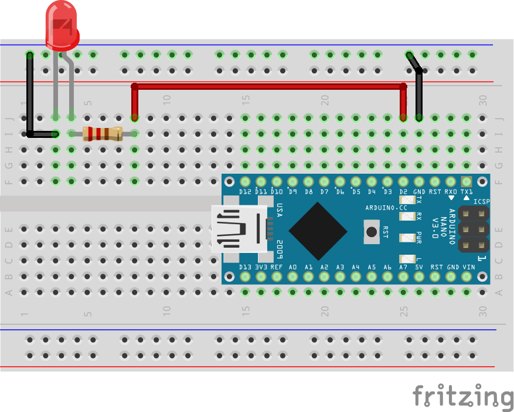

# IoT Controller LED Light

An IoT enabled device that allows remote control of an LED light via the internet is being developed as part of this full-stack project. A Node.js backend and a React.js frontend are used in the system's construction, with an Arduino Nano serving as the main hardware component. By facilitating communication between the Arduino and the client interface, the backend server allows any internet-connected device to manage the LED's on/off status in real time. This configuration offers an easy-to-use interface for remote device administration and shows how IoT hardware may be seamlessly integrated with contemporary web technologies.




## Hardware Requirement

- Arduino Nano/UNO
- 5mm LED Light (1 piece)
- 220ohm resistor (1 piece)
- Micro USB Cable for Arduino Nano
- Mini breadboard
- Jumper wire

## Software Requirement

- Arduino IDE
- Node.js

## Circuit Setup



Circuit connection is as follows:

1. D2 pin(Arduino nano) to resister
2. Resister to Anode Pin (LED)
3. Cathode Pin (Led) to GND Pin (Arduino Nano)

## Usage or Installation

Step-1 : Clone the repository
First you need to clone the repository in your local machine.

```bash
git clone https://github.com/km-saifullah/iot-controlled-led.git
```

Step-2: Navigate to the toggle-led directory

```bash
cd toggle-led
```

Step-3: Upload the Arduino code into your Arduino

1. Connect your Arduino board with your pc/laptop using the USB cable
2. Open the Arduino IDE
3. Select your Arduino board from the board section
4. Choose the write port from the port option

Step-4 : Navigate to the client directory and run the client

```bash
cd client
npm install
npm run dev
```

Step-5: Start the fontend in your browser

```bash
http://localhost:5173
```

Step-6: Navigate to the server directory and run the server

```bash
cd server
npm install
```

Step-7: Change the code in the **server.js** file a bit

```javascript
const port = new SerialPort({ path: "/dev/ttyUSB0", baudRate: 9600 });
```

Here, you need to replace the **/dev/ttyUSB0** with your device port.

## Testing

1. Open your browser and hit this link `http://localhost:5173`
2. Turn on and off the led by pressing the button

Happy Coding...✌️✌️
